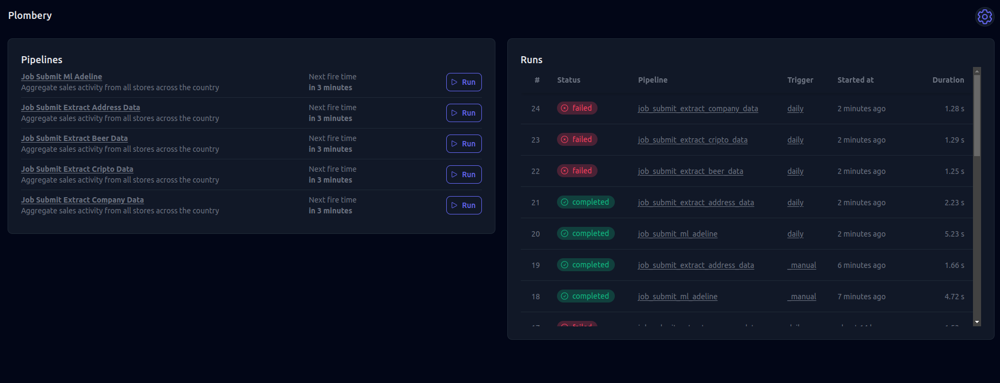

# ml-orquestrations-batch

Este repositório contém o código para executar um pipeline de orquestração de machine learning em batch usando Docker.

## Estrutura do Projeto

- `requirements.txt`: Arquivo contendo as dependências do projeto.
- `src/`: Diretório contendo o código fonte da aplicação.
  - `main.py`: Script principal para execução da aplicação.
- `plombery.db`: Arquivo de banco de dados necessário para a aplicação.

## Pré-requisitos

- Docker
- Python 3.9+
- `black` (para formatação de código)

## Configuração

### Instalação do Docker

Siga as instruções oficiais para instalar o Docker: [Instalação do Docker](https://docs.docker.com/get-docker/)

### Utilização do Makefile

```sh
env➜  ml-orquestrations-batch git:(main) make help
Escolha um alvo para executar:
build           Constrói a imagem Docker
run             Executa o contêiner Docker em segundo plano
stop            Para e remove o contêiner Docker
clean           Limpa as imagens e contêineres Docker
format          Formata o código na pasta src usando black
```

### Orquestração

 

 Um agendador de tarefas de código aberto (licença MIT) para Python, com uma interface web e uma API REST. Se você precisa executar e monitorar scripts Python recorrentes, este é a ferramenta certa para você!

Características:

- ⏰ Agendamento de tarefas baseado no APScheduler (suporta gatilhos de Intervalo, Cron e Data)
- 💻 Interface Web integrada, sem necessidade de codificação em HTML/JS/CSS
- 👩‍💻🐍 Pipelines e tarefas definidas puramente em Python
- 🎛️ Pipelines podem ser parametrizados via Pydantic
- 👉 Pipelines podem ser executados manualmente a partir da interface web
- 🔐 Segurança via OAuth2
- 🔍 Depuração de cada execução explorando logs e dados de saída
- 📩 Monitoramento das pipelines com alertas em caso de falhas
- 💣 Uso da API REST para integrações avançadas